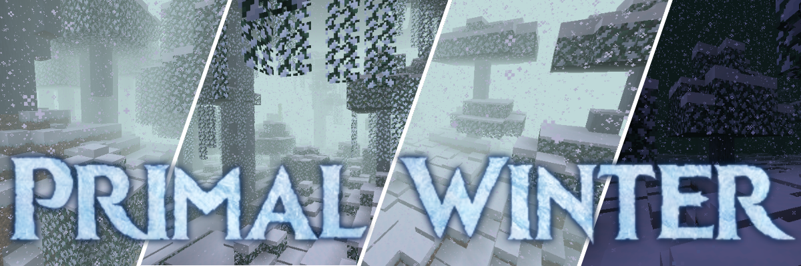
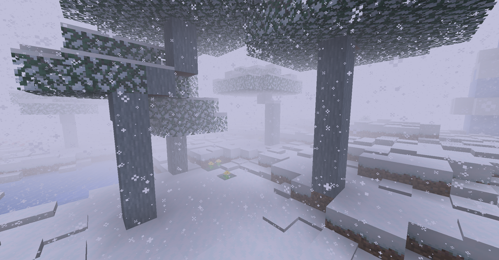
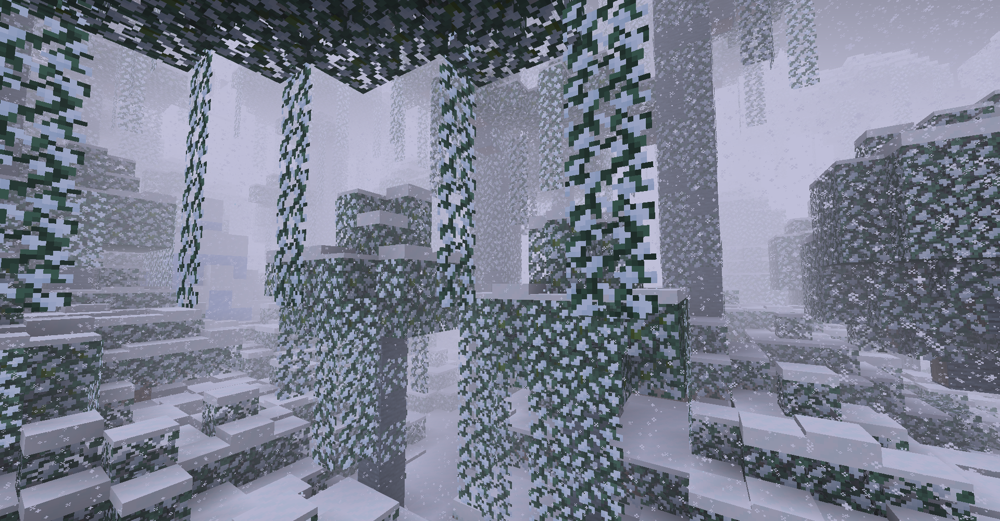

_A horrible accident has left the world - the **entire** world - a frozen wasteland. Unending snowstorms rage across the land, from forests, to plains, to jungles, to deserts. The air is thick with fog and wind howls across the landscape. Will you be able to survive in this primordial winter?_

### Availability

Primal Winter is available for the following Minecraft and mod loader versions:

- 1.18.2: Fabric and Forge
- 1.16.2: Fabric and Forge
- 1.15.2: Forge

### Features

This mod will turn your entire world into a frozen wasteland. It adds several new blocks, and has many client side aesthetic tweaks to immerse yourself in the winter wonderland you now inhabit.

- A thick white fog obscures your view when you are outside.
- The weather is always snowy and thundering, and there's more snow including extra particle effects and sounds.
- Most surface blocks are replaced with snowy variants. These can be mined to obtain their vanilla counterparts.
- Polar bears and strays now spawn everywhere.
- Ice spikes, icebergs, snow blocks, packed ice, and powder snow all appear sporadically in all biomes.
- Snow and ice placement has been improved and now layers more intuitively and can creep into caves and under overhangs such as trees during world generation.
- Works automatically with any other mods which add new biomes, forcefully converting them to winter versions.

### Credit

Thanks to EERussianGuy for making all the wood logs and leaf textures. Thanks to various people in the TerraFirmaCraft discord for their feedback and ideas.

Hope you enjoy, and stay warm!

~ AlcatrazEscapee
